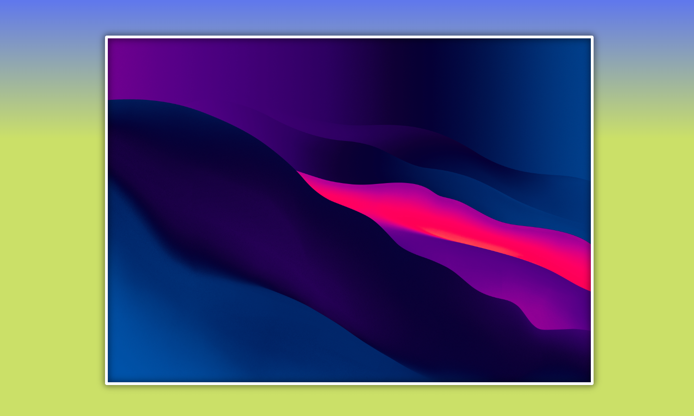

    <b>🍀🌱 A simple JavaScript Vanilla app that allows you to upload a photo and download it again with a custom background.</b>

## Table of contents 👇

-   [✨ Explanation](#-explanation)
-   [🎨 Customization and features](#-customization-and-features)
-   [🚀 Usage](#-usage)
-   [🚩 Issues](#-issues)
-   [💛 Contact](#-contact)

### ✨ Explanation

### 🎨 Customization and features

### 🚀 Usage

### 🚩 Issues

### 💛 Contact

If you have some doubts or need to ask something about the project, feel free to reach me here:

-   Twitter: [https://twitter.com/jgcarrillo](https://twitter.com/jgcarrillo_)
-   LinkedIn: [https://es.linkedin.com/in/jgcarrilloweb](https://es.linkedin.com/in/jgcarrilloweb)
-   Website: [https://jgcarrillo.com/](https://jgcarrillo.com/)
